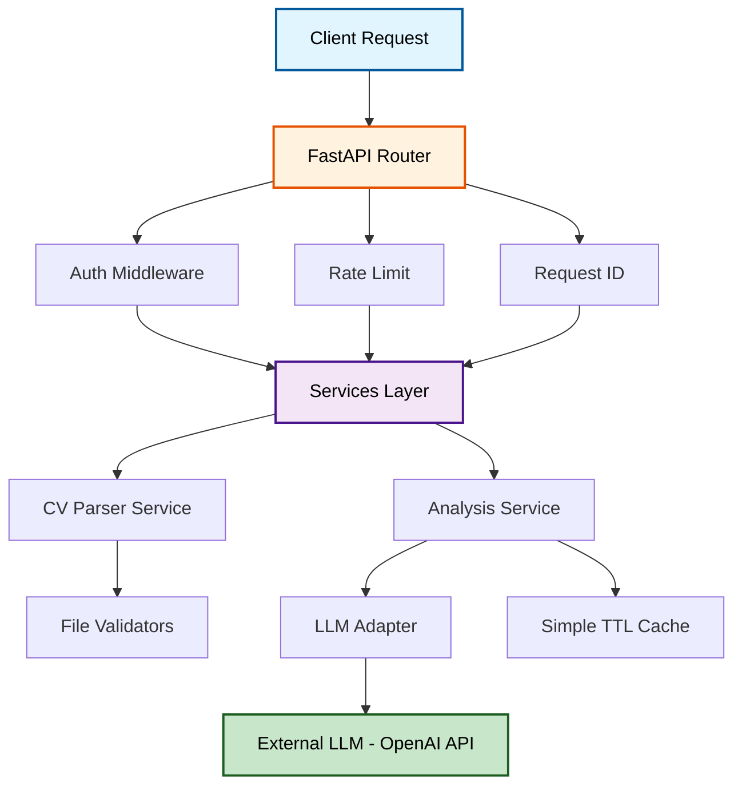

# CV Analyzer API

> **Production-grade API for analyzing resumes against job descriptions using LLM-powered structured analysis**

[](https://www.python.org/downloads/)
[](https://fastapi.tiangolo.com/)
[](https://opensource.org/licenses/MIT)
[](./tests)

---

## 📖 Overview

**CV Analyzer API** transforms resume screening from subjective guesswork into data-driven decision-making. Upload a CV (PDF/DOCX) and job description, receive a structured JSON response with:

- **Quantified fit score** (0-100) with evidence-based rationale
- **Gap analysis** and **strengths** mapped to job requirements
- **Missing keywords** and **rewrite suggestions** for ATS optimization
- **Red flags** detection and **actionable next steps**

**Target users**: Job seekers (self-service), recruiters (pre-screening), career coaches (bulk analysis), and ATS vendors (API integration).

**Core philosophy**: Responsible AI with anti-hallucination measures, security-first design, and production-ready architecture.

---

## 🎯 Technical Highlights

This project demonstrates production-grade API engineering:

### **LLM Integration with Guardrails**
- ✅ **Schema enforcement**: Pydantic validation prevents malformed outputs
- ✅ **Anti-hallucination**: Requires LLM to cite CV quotes as evidence for claims
- ✅ **Provider abstraction**: Swap OpenAI/Anthropic/Ollama via factory pattern
- ✅ **Retry logic**: Handles LLM failures gracefully with fallback

### **Security & Performance**
- 🔐 **API key authentication**: Configurable per-key rate limiting
- 🚦 **Rate limiting**: Prevents abuse (10 req/min default, customizable)
- 💾 **Hash-based caching**: Avoid redundant LLM calls (TTL + LRU eviction)
- 🔒 **Sensitive data redaction**: Automatic filtering in logs (CV text, API keys)

### **Resilience & Validation**
- 📄 **File signature validation**: Magic byte checks (prevents fake extensions)
- ⏱️ **Extraction timeouts**: PDF/DOCX parsing with 10s timeout guard
- 🤖 **Semantic validation**: LLM detects gibberish CVs or irrelevant job descriptions
- 📏 **Multi-level limits**: File size, character count, PDF pages, DOCX paragraphs

### **Engineering Best Practices**
- 🧪 **Comprehensive testing**: 16 test suites (unit + integration coverage)
- 🌍 **Multi-environment config**: Dev/test/staging/production separation
- 📊 **Structured logging**: JSON format with request tracing, rotation, retention policies
- 🏗️ **Clean architecture**: Services, adapters, routers (testable, extensible)

---

## 🏛️ Architecture



**Design Rationale**:
- **Separation of concerns**: Routes handle HTTP, services handle business logic, adapters handle external integrations
- **Testability**: Each layer can be mocked/tested independently
- **Extensibility**: Add new LLM providers by implementing `AbstractLLMClient`
- **Security**: Authentication/rate limiting as middleware (applies globally)

---

## 💼 Use Cases

- **Job Seekers**: Get actionable feedback to improve CV-to-job alignment (self-service)
- **Recruiters**: Pre-screen candidates with quantified fit scores at scale
- **Career Coaches**: Generate gap analysis and rewrite suggestions for clients
- **ATS Vendors**: Integrate CV analysis into existing recruitment workflows via API

---

## 🧱 Tech Stack

| Layer | Technology | Why? |
|-------|-----------|------|
| **Framework** | FastAPI | Async support, automatic OpenAPI docs, type safety |
| **Validation** | Pydantic v2 | Schema enforcement, settings management, type coercion |
| **LLM** | OpenAI SDK | Structured outputs, proven reliability (extensible to others) |
| **Parsing** | pypdf, python-docx | Text extraction from resumes |
| **Testing** | pytest + pytest-asyncio | Async test support, fixtures, coverage |
| **Container** | Docker + Compose | Reproducible environments, multi-stage builds |
| **Config** | pydantic-settings + dotenv | Environment-aware (dev/test/prod), validation on startup |
| **Logging** | stdlib logging + JSON | Structured logs, sensitive data redaction, rotation |

---

## ⚡ Quick Start

### **Option 1: Docker (Recommended)**

```bash
# 1. Clone and configure
git clone <repository-url>
cd cv-analyzer-api
cp .env.example .env.development

# 2. Edit .env.development with your credentials
# Required: LLM_PROVIDER, LLM_API_KEY, LLM_MODEL, APP_API_KEYS

# 3. Run with Docker Compose
docker compose up --build

# 4. Verify (health check doesn't require auth)
curl http://localhost:8000/health
```

### **Option 2: Local Python (Development)**

```bash
# 1. Setup virtual environment
python3.11 -m venv .venv
source .venv/bin/activate  # Linux/Mac
# .venv\Scripts\activate   # Windows

# 2. Install dependencies
pip install -r requirements.txt

# 3. Configure environment
cp .env.example .env.development
# Edit .env.development with your credentials

# 4. Run server
uvicorn app.main:app --reload

# 5. Access interactive docs
open http://localhost:8000/docs
```

---

## 📋 API Reference

### **Authentication**

All endpoints (except `/health`) require the `X-API-Key` header:

```bash
curl -H "X-API-Key: your-secret-key" \
     http://localhost:8000/v1/cv/parse
```

### **Endpoints**

#### `GET /health`
Health check (no auth required).

```bash
curl http://localhost:8000/health
# Response: {"status": "ok"}
```

#### `POST /v1/cv/parse`
Extract and normalize CV text.

**Request**:
```bash
curl -X POST "http://localhost:8000/v1/cv/parse" \
  -H "X-API-Key: your-key" \
  -F "cv_file=@resume.pdf"
```

**Response**:
```json
{
  "filename": "resume.pdf",
  "file_type": "application/pdf",
  "text_preview": "John Doe\nSoftware Engineer...",
  "char_count": 4523,
  "metadata": {
    "pdf_pages": 2,
    "extraction_time_ms": 145
  }
}
```

#### `POST /v1/cv/analyze`
Analyze CV against job description.

**Request**:
```bash
curl -X POST "http://localhost:8000/v1/cv/analyze" \
  -H "X-API-Key: your-key" \
  -F "cv_file=@resume.pdf" \
  -F "job_description=Senior Python Developer with 5+ years experience..."
```

**Response**:
```json
{
  "summary": "Candidate shows strong Python background...",
  "fit_score": 78,
  "fit_score_rationale": "5 years Python experience matches requirement...",
  "strengths": [
    "Expert in FastAPI and async patterns",
    "Production experience with Docker/K8s"
  ],
  "gaps": [
    "No mention of AWS/GCP cloud platforms",
    "Limited data engineering experience"
  ],
  "missing_keywords": ["AWS", "Terraform", "Airflow"],
  "rewrite_suggestions": [
    "Add 'cloud deployment' to skills section",
    "Quantify team leadership experience"
  ],
  "ats_notes": [
    "Use standard section headers (Experience, Education)",
    "Include keywords from job description naturally"
  ],
  "red_flags": ["Gap in employment 2022-2023 not explained"],
  "next_steps": [
    "Add cloud certifications to CV",
    "Prepare story for employment gap"
  ]
}
```

### **Python Client Example**

```python
import requests

def analyze_cv(cv_path: str, job_desc: str, api_key: str) -> dict:
    """Analyze CV against job description."""
    with open(cv_path, 'rb') as f:
        response = requests.post(
            'http://localhost:8000/v1/cv/analyze',
            files={'cv_file': f},
            data={'job_description': job_desc},
            headers={'X-API-Key': api_key}
        )
    response.raise_for_status()
    return response.json()

# Usage
result = analyze_cv(
    cv_path='resume.pdf',
    job_desc='Senior Backend Engineer with Python...',
    api_key='your-secret-key'
)
print(f"Fit Score: {result['fit_score']}/100")
print(f"Strengths: {', '.join(result['strengths'][:3])}")
```

---

## 🔧 Configuration

Configuration is environment-aware (loads `.env.{APP_ENV}` automatically).

### **Required Environment Variables**

```bash
# LLM Provider (Required)
LLM_PROVIDER=openai
LLM_API_KEY=sk-your-openai-key
LLM_MODEL=gpt-4o

# Security (Required for production)
APP_API_KEYS=key1,key2,key3  # Comma-separated
```

### **Optional Configuration**

| Variable | Default | Description |
|----------|---------|-------------|
| `APP_DEBUG` | `false` | Enable verbose logging |
| `APP_MAX_UPLOAD_SIZE_MB` | `10` | File upload limit |
| `APP_MAX_CV_CHARS` | `50000` | CV text length limit |
| `APP_MAX_JOB_DESC_CHARS` | `10000` | Job description length limit |
| `APP_RATE_LIMIT_REQUESTS` | `10` | Requests per window |
| `APP_RATE_LIMIT_WINDOW_SECONDS` | `60` | Rate limit window size |
| `LOG_LEVEL` | `info` | Logging level (debug/info/warning/error) |
| `LOG_FORMAT` | `json` | Log format (json/plain) |

See [.env.example](.env.example) for complete configuration options.

---

## 🧪 Testing

### **Run All Tests**

```bash
# Local (with venv active)
pytest -v

# Docker
docker compose -f docker-compose.test.yml run --rm api
```

### **Test Coverage**

16 test suites covering:
- ✅ File validation (signature, size, timeout)
- ✅ Authentication and rate limiting
- ✅ CV parsing (PDF/DOCX extraction)
- ✅ Semantic validation (LLM-based)
- ✅ Analysis service (caching, retry logic)
- ✅ Exception handling and logging filters

```bash
# Generate coverage report
pytest --cov=app --cov-report=html
open htmlcov/index.html
```

---

## 🔒 Security Considerations

### **Authentication**
- API key required for all endpoints (except `/health`)
- Keys configurable via `APP_API_KEYS` environment variable
- Disable auth in dev with `APP_API_KEY_REQUIRED=false`

### **Rate Limiting**
- Default: 10 requests per minute per API key
- Returns `429 Too Many Requests` with `Retry-After` header
- Configurable per-environment

### **Data Protection**
- **No persistent storage**: CVs processed in-memory only
- **Automatic log redaction**: Sensitive fields (CV text, API keys) filtered
- **File signature validation**: Prevents malicious file uploads
- **Extraction timeouts**: Guards against zip bombs / malformed files

### **Input Validation**
- File type whitelist (PDF, DOCX only)
- Character limits for CV and job description
- Semantic validation (detects gibberish via LLM)

---

## ⚠️ Known Limitations

These are **intentional MVP trade-offs** for rapid iteration. The architecture supports these enhancements without refactoring:

- **PDF Support**: Text-based only (no OCR for image-based PDFs)
- **Cache**: In-memory (resets on restart; production would use Redis/Memcached)
- **LLM Providers**: OpenAI only (adapter pattern ready for Anthropic/Ollama)
- **Batch Processing**: Single CV analysis (no multi-file upload endpoint)
- **Export Formats**: JSON only (no PDF/CSV report generation)
- **Job Input**: Plain text only (no URL scraping)

---

## 🛠️ Development

### **Project Structure**

```
cv-analyzer-api/
├── app/
│   ├── adapters/          # External integrations (LLM, rate limit)
│   │   ├── llm/           # LLM provider abstraction
│   │   └── rate_limit/    # Rate limiting adapters
│   ├── api/
│   │   └── routes/        # HTTP endpoints (cv.py, health.py)
│   ├── core/              # Core logic (config, auth, middleware)
│   ├── schemas/           # Pydantic models (request/response)
│   ├── services/          # Business logic (analysis, parsing)
│   └── utils/             # Helpers (extractors, validators, cache)
├── tests/                 # 16 test suites
├── .env.example           # Configuration template
├── docker-compose.yml     # Production container setup
└── requirements.txt       # Python dependencies
```

### **Adding a New LLM Provider**

1. **Create adapter** in `app/adapters/llm/`:
   ```python
   from app.adapters.llm.base import AbstractLLMClient
   
   class AnthropicClient(AbstractLLMClient):
       async def analyze_cv(self, cv_text: str, job_text: str) -> dict:
           # Implementation
   ```

2. **Register in factory** (`app/adapters/llm/factory.py`):
   ```python
   if provider == "anthropic":
       return AnthropicClient(settings.llm)
   ```

3. **Configure** via environment:
   ```bash
   LLM_PROVIDER=anthropic
   LLM_API_KEY=your-anthropic-key
   LLM_MODEL=claude-3-5-sonnet
   ```

### **Code Conventions**

- **Language**: All code, docstrings, and comments in English
- **Docstrings**: Google-style with type hints
- **Naming**: `snake_case` for functions/variables, `PascalCase` for classes
- **Type hints**: Mandatory for public functions
- **Testing**: Each new feature requires corresponding test coverage

---

## 📄 License

This project is licensed under the MIT License. See [LICENSE](LICENSE) for details.

---

## 🤝 Contributing

Contributions are welcome! Please:

1. Fork the repository
2. Create a feature branch (`git checkout -b feature/amazing-feature`)
3. Run tests locally (`pytest -v`)
4. Commit with clear messages
5. Push and open a Pull Request

For major changes, open an issue first to discuss the proposed change.

---

## 📞 Support & Contact

For bugs, features, or technical questions about this project:  
**[Open a GitHub Issue](https://github.com/soumarcone/cv-analyzer-api/issues)**

---

### Connect

- **GitHub**: [@soumarcone](https://github.com/soumarcone)
- **LinkedIn**: [Marcone Ramos](https://www.linkedin.com/in/marconeramos/)

---

**Built with ❤️ using FastAPI, OpenAI, and modern Python best practices.**
